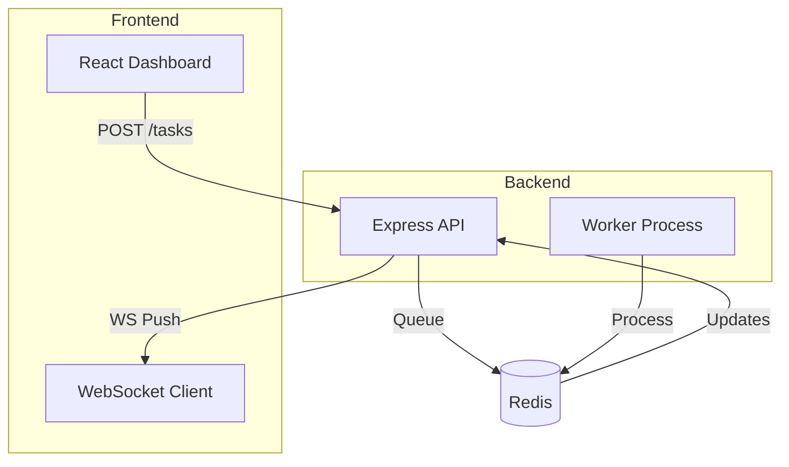

# Orbit: The Antigravity Mastery Guide

Welcome to **Project Orbit**. This repository is your training ground.
Your goal is to build an **AI Task Orchestration Platform** following the instructions below.
This project simulates a real-world complex engineering task to help you master the Antigravity IDE.

> [!TIP]
> **Your Game Master**: I have included a script `verify_orbit.js` in this directory.
> Run it at any time to check your progress:
> ```bash
> node verify_orbit.js
> ```

## System Architecture

Before you build, visualize what you are creating:



---

## Phase 1: The Architect (Planning)

**Objective**: Define the system before writing code. This teaches you how Antigravity uses context files.

1.  **Initialize the Project**:
    - You are already in the workspace.
    - If you dug this repo, it's already a git repo. If not, run `git init`.

2.  **Define the Product (PRD)**:
    - Create a file `PRD.md` in the root.
    - Copy the content below into it (or write your own based on it):
      <details>
      <summary>Click to Copy PRD Content</summary>

      ```markdown
      # Product Requirements Document: Orbit
      ## Overview
      Orbit is a dashboard for visualizing long-running background tasks.
      ## Features
      - **Task Submission**: POST /api/tasks (Type: Research, Analysis)
      - **Worker Queue**: Redis-backed queue for asynchronous processing.
      - **Real-time Status**: WebSocket updates for task progress.
      ```
      </details>
    - *Tip*: Commit this file! `git add PRD.md && git commit -m "Add PRD"`

3.  **Define the Codebase Roles**:
    - Create a directory `.agent/active_context` (you may need to create the folders).
    - Create a file `.agent/active_context/roles.md`.
    - Content:
      ```markdown
      # Roles
      - **Architect**: Responsible for system design and PRDs.
      - **Frontend Specialist**: Focus on React, Tailwind, and UX.
      - **Backend Engineer**: Focus on Node.js, Redis, and APIs.
      ```

> **Checkpoint**: Check your **Mission Control Dashboard** to see if Phase 1 turns Green!

---

## Phase 2: The Engineer (Backend Setup)

**Objective**: Build a robust backend with a worker queue.

1.  **Scaffold the Server**:
    - Create a `server` directory in the root.
    - Initialize: `cd server && npm init -y`.
    - Install dependencies: `npm install express redis bullmq cors ws`.
    - **M1/8GB Optimization**: If you don't have Docker, install Redis via brew: `brew install redis && brew services start redis`.

2.  **Create the API (server/index.js)**:
    - Create a basic Express server monitoring port 3000.
    - Add a POST `/tasks` endpoint that adds a job to a BullMQ queue named `orbit-tasks`.

3.  **Create the Worker (server/worker.js)**:
    - Create a worker script that processes `orbit-tasks`.
    - **Simulation**: Make the process function sleep for 5 seconds to simulate "AI Work".
    - `console.log` when a job starts and finishes.

> **Checkpoint**: Check Mision Control!

---

## Phase 3: The Frontend Specialist (Dashboard)

**Objective**: Visualize the state.

1.  **Scaffold the Client**:
    - Go back to root: `cd ..`.
    - Create Vite app: `npm create vite@latest client -- --template react`.
    - Install: `cd client && npm install`.

2.  **Connect to API**:
    - Create a button "Start Mission" that calls `POST http://localhost:3000/tasks`.
    - Display a list of active tasks.

> **Checkpoint**: Check Mission Control!

---

## Phase 4: The Verifier (Testing & Security)

1.  **Security Audit**:
    - Run `npm audit` in the server directory.
    - Create a `SECURITY.md` file listing any findings (or "No Critical Vulns").

2.  **Changelog**:
    - Create a `CHANGELOG.md` file.
    - Add an entry for "v0.1.0 - Initial Release".

---

## Final Verification

If you see all green checks on your Dashboard, congratulations! You have mastered the basics of the Antigravity IDE workflow.
